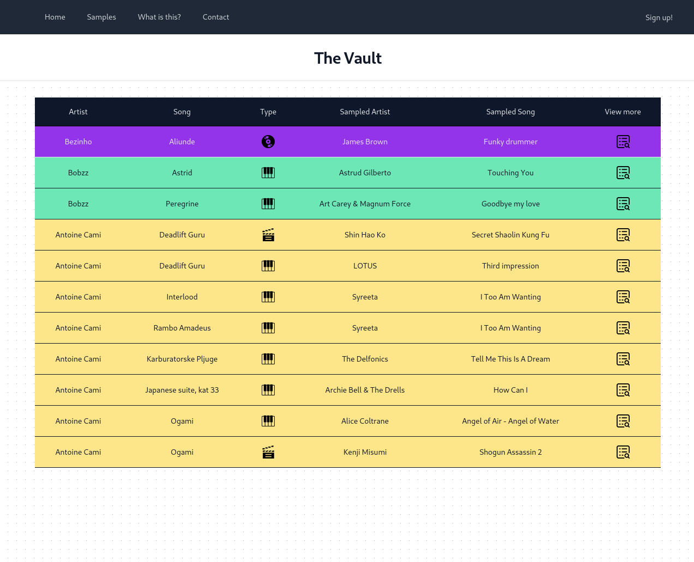

# The Vault

"The Vault" is a PHP-based website dedicated to preserving information about music samples, focusing on my own music. The project is crafted with pure PHP for the server back-end, complemented by the front-end components of Tailwind CSS.

**Key Features:**

- **Sample Documentation:** Capture and catalog information about samples used in music, offering a comprehensive resource for enthusiasts.
- **Artist Selection:** The website exclusively supports samples from chosen artists, ensuring a curated and focused collection.
- **Learning Environment:** "The Vault" serves as a personal training ground, incorporating advanced PHP patterns such as factories, singletons, custom routers, and custom service containers.

**Technology Stack:**

- **Back-end:** PHP
- **Front-end:** HTML, Tailwind
- **Database:** MariaDB

**On user accessibility:**
- In its current implementation, this is a static website that doesn't allow for registration of new users or adding of samples outsid of administratie accounts. This was done on purpose as the goal of this project is to achieve a web application that interacts with an archive and isn't meant to be taken as a forum where users can submit any content. If you are viewing this project as a **recruiter**, please look into my **other projects** where I showcase my ability to implement such capabilites. Otherwise, please respect the design choice and if you want to implement your own version of this project open for public admission, my code is already capable of handling such functionality, it just needs to be written.

**Further Ideas**
\Currently my bandcamp account is on a waitlist for approval of use of their API so currently data to actual songs is also hard coded into the about page. Eventually there will need to be some amount of refactoring done.
- Fully implement model usage along with User model
- Simplify the sample inserting process
- Dynamically fetch data from bandcamp to display newly released albums

